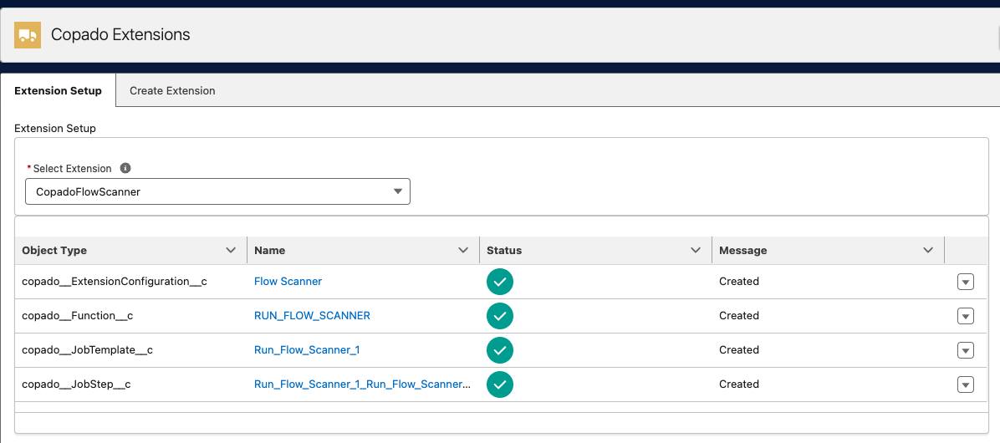
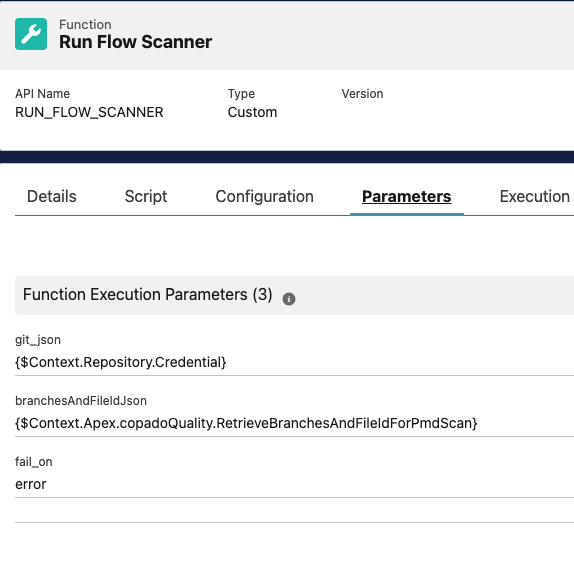
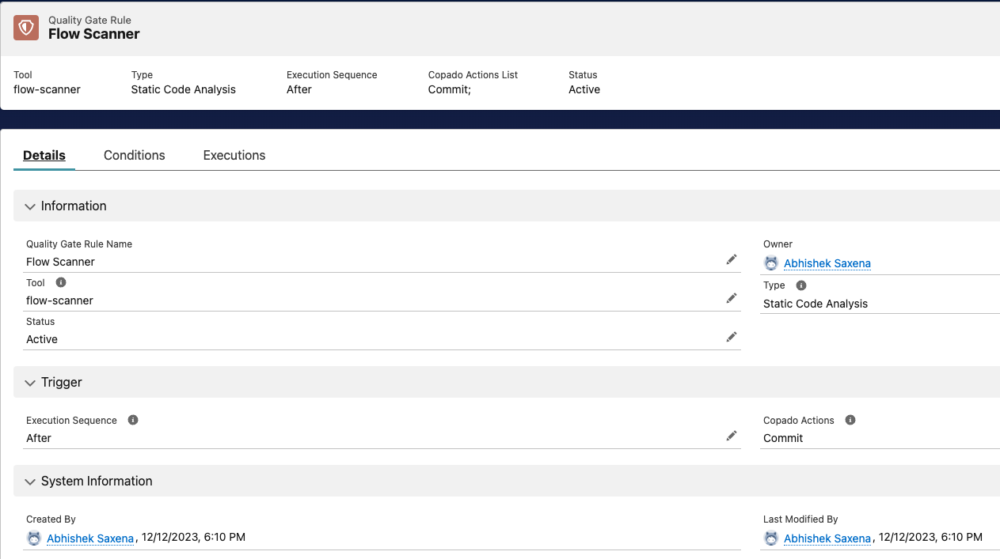
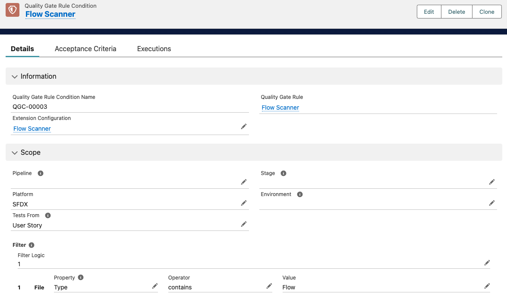

  

Scans for unsafe contexts, hardcoded IDs, and other issues to optimize your Flows.

###### [Watch the full Flow Scanner Demo](https://www.loom.com/share/d5fc87459e714e94b72abcd5511be5d8)

- [Usage](#usage)
- [Installation](#installation)
- [Configuration](#configuration)

  - [Defining the severity per rule](#defining-the-severity-per-rule)
  - [Specifying an exception](#specifying-an-exception)
  - [Configuring an expression](#configuring-an-expression)
- [Contribution Guidelines](#contribution-guidelines)

## Usage

Copado Flow Scanner is a plugin to boost your Salesforce deployments by integrating Lightning Flow Scanner as a Quality Gate within Copado, to analyze updated Flows in your User Story, ensuring top-notch quality before every deployment. View comprehensive results directly within Copado for streamlined, confident releases. For more information on the default rules and configurations available, please review the[ flow scanner documentation](https://flow-scanner.github.io/lightning-flow-scanner-core/).

##### Pre-Requisites

* Copado v21.14 or higher
* Copado Quality Tools extension v1.42 or higher

## Installation

### Picklist Values

Create the Following Picklist values

* **Object: Extension Configuration** > Field: Extension Tool, Value: `flow-scanner`
* **Picklist Value Set** > Copado Test Tool, Value: `flow-scanner`

### Create The Functions and Job Templates

Navigate to the “Copado Extensions” tab, select “CopadoFlowScanner” and press the button “Generate Extension Records”.

### Configure Acceptance Criteria via a Function Parameter

 

`fail_on` - This parameter can take one of three rule severity values - `error`, `note` or `warning`. The default value of it is `error`. This parameter decides when should the Quality Gate fail.

- Setting it to `error` means - Succeed the Quality Gate, if their are no violations or they are only of type `warning` or `note`. Fail on violations of severity `error`.
- Setting it to `warning` means - Succeed the Quality Gate, if their are no violations or they are only of type or `note`. Fail on violations of severity `error` or `warning`.
- Setting it to `note` means - Succeed the Quality Gate, if their are no violations. Fail on any violations irrespective of severity.

By default, all rules have a severity of `error`. To customize behaviour, check the [core documentation](https://flow-scanner.github.io/lightning-flow-scanner-core/) on how to create a  `.flow-scanner.json` configuration file.

## Configure the Quality Gate

### Create the Quality Gate Rule

Navigate to the Quality Gate Rules tab and create a new record as follows. Note that the Type field will be populated automatically upon save. The global value set Test Tool should have a value for `Flow Scanner` as part of this package. It can be created manually if necessary.

### Create the Quality Gate Rule Condition

Set the conditions so that it only applies to `Pipelines/Stages/Environments` with Platform = `SFDX`. This picklist value can be added manually if necessary.
Once saved, press the “Activate” button on the Quality Gate Rule record. To run Flow Scanner only when Flows are committed, add Filter Logic as demonstrated below:

**You are all set.** To test the configuration, just perform a commit, and the Commit Action will call `Flow Scanner` after every commit.

If you'd like to help us enhance Flow Scanner, please consider having a look at the [Contributing Guidelines](https://github.com/Flow-Scanner/lightning-flow-scanner-core/blob/main/CONTRIBUTING.md).
